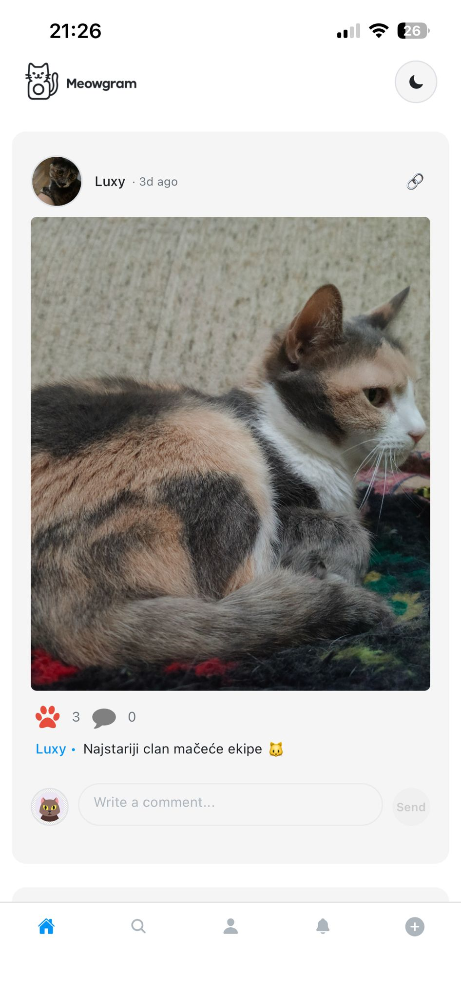
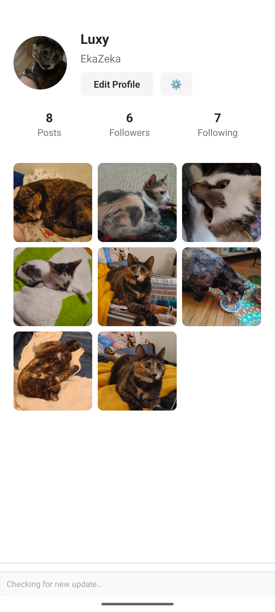

# 🐱 MeowSpace

<div align="center">


**A modern social media platform for sharing and discovering amazing cat photos**

[Features](#-features) • [Screenshots](#-screenshots) • [Tech Stack](#-tech-stack) • [Installation](#-installation) • [Architecture](#-architecture) • [License](#-license)

</div>

---

## 📱 Overview

MeowSpace is a feature-rich, Instagram-inspired social media application built with React Native and Expo. Designed specifically for cat lovers, it provides a seamless platform for sharing photos, engaging with the community, and connecting through real-time messaging.

The app leverages modern mobile development practices with Firebase for backend services, Cloudinary for optimized image delivery, and Socket.IO for real-time communication features.

## ✨ Features

### 🔐 Authentication & User Management

- **Email/Password Authentication** - Secure user registration and login
- **Google OAuth Integration** - One-tap sign-in with Google
- **Profile Customization** - Editable profiles with avatar, bio, and display name
- **Follow System** - Follow/unfollow users and build your network
- **User Discovery** - Search and find other users

### 📸 Content Sharing

- **Photo Uploads** - Share your favorite cat photos with the community
- **Image Cropping** - Built-in image editor for perfect framing
- **Caption Support** - Add descriptions to your posts
- **Progressive Image Loading** - Fast loading with thumbnail → full resolution
- **Optimized Delivery** - Cloudinary CDN integration for blazing-fast image loads

### 💬 Social Interactions

- **Like & Comment** - Engage with posts through likes and comments
- **Real-time Comments** - Live comment updates with Firestore listeners
- **Post Details** - Detailed view with full comment threads
- **User Mentions** - Tag users in captions and comments
- **Activity Feed** - Track likes, comments, and new followers

### 🗨️ Real-time Messaging

- **Direct Messaging** - Private one-on-one conversations
- **Message Threading** - Reply to specific messages
- **Read Receipts** - See when messages are read
- **Message Management** - Edit and delete your messages
- **Conversation List** - All your chats in one place with unread badges
- **Socket.IO Integration** - Real-time message delivery
- **Media Sharing** - Send images in conversations

### 🔔 Notifications

- **Activity Notifications** - Get notified about likes, comments, and follows
- **Unread Badges** - Visual indicators for new activity
- **Auto-read Marking** - Mark notifications as read when viewed

### 🎨 User Experience

- **Theme Support** - Consistent design system with ThemeContext
- **Responsive Design** - Optimized for various screen sizes
- **Smooth Animations** - Polished interactions and transitions
- **Pull-to-Refresh** - Refresh content with a simple gesture
- **Double-tap to Like** - Instagram-style interaction
- **Offline Support** - Firebase persistence for offline functionality

## 📸 Screenshots

<div align="center">
  
  
</div>

## 🛠️ Tech Stack

### Frontend

- **React Native** (0.81.5) - Cross-platform mobile framework
- **Expo** (~54.0.25) - Development platform and toolchain
- **TypeScript** (5.9.2) - Type-safe JavaScript
- **React Navigation** (7.x) - Navigation library with stack and tab navigators
- **Expo Image** - High-performance image component with caching

### Backend & Services

- **Firebase Authentication** - User authentication and management
- **Cloud Firestore** - NoSQL database for real-time data
- **Firebase Storage** - Cloud file storage
- **Socket.IO Client** (4.8.1) - Real-time bidirectional communication

### State Management

- **React Context API** - Global state management
  - `AuthContext` - Authentication state
  - `ChatContext` - Messaging state and logic
  - `ThemeContext` - Theme and styling

### Image Processing

- **Cloudinary** - CDN and image optimization
- **Expo Image Picker** - Native image selection
- **Expo Image Manipulator** - Image editing and cropping
- **Jimp** (1.6.0) - JavaScript image processing

### Development Tools

- **EAS Build** - Cloud build service for native builds
- **Expo Dev Client** - Custom development builds
- **TypeScript** - Static type checking
- **AsyncStorage** - Local storage for persistence

## 📦 Installation

### Prerequisites

- **Node.js** (v18 or higher)
- **npm** or **yarn**
- **Expo CLI**: `npm install -g expo-cli`
- **Android Studio** (for Android development)
- **Xcode** (for iOS development, macOS only)
- **EAS CLI** (optional, for builds): `npm install -g eas-cli`

### Environment Setup

1. **Clone the repository**

   ```bash
   git clone https://github.com/blagojevics/meowgram-mobile-app.git
   cd meowgram-mobile-app
   ```

2. **Install dependencies**

   ```bash
   npm install
   ```

3. **Create environment configuration**

   Create a `.env` file in the root directory with the following variables:

   ```env
   # Firebase Configuration
   EXPO_PUBLIC_FIREBASE_API_KEY=your_firebase_api_key
   EXPO_PUBLIC_FIREBASE_AUTH_DOMAIN=your_project_id.firebaseapp.com
   EXPO_PUBLIC_FIREBASE_PROJECT_ID=your_project_id
   EXPO_PUBLIC_FIREBASE_STORAGE_BUCKET=your_project_id.appspot.com
   EXPO_PUBLIC_FIREBASE_MESSAGING_SENDER_ID=your_sender_id
   EXPO_PUBLIC_FIREBASE_APP_ID=your_app_id

   # Cloudinary Configuration
   EXPO_PUBLIC_CLOUDINARY_CLOUD_NAME=your_cloudinary_cloud_name
   EXPO_PUBLIC_CLOUDINARY_UPLOAD_PRESET=your_upload_preset

   # Google OAuth (optional)
   EXPO_PUBLIC_GOOGLE_WEB_CLIENT_ID=your_web_client_id
   EXPO_PUBLIC_GOOGLE_ANDROID_CLIENT_ID=your_android_client_id
   EXPO_PUBLIC_GOOGLE_IOS_CLIENT_ID=your_ios_client_id
   EXPO_PUBLIC_GOOGLE_EXPO_CLIENT_ID=your_expo_client_id
   ```

4. **Update Firebase configuration in app.json**

   Edit `app.json` and update the `extra` section with your Firebase credentials.

### Firebase Setup

1. **Create a Firebase Project**

   - Go to [Firebase Console](https://console.firebase.google.com/)
   - Create a new project
   - Enable Authentication (Email/Password and Google)
   - Create a Firestore Database
   - Set up Firebase Storage

2. **Deploy Firestore Security Rules**

   ```bash
   firebase deploy --only firestore:rules
   ```

3. **Firestore Collections Structure**
   The app uses the following collections:
   - `users` - User profiles
   - `posts` - Photo posts
   - `comments` - Post comments
   - `notifications` - User notifications
   - `conversations` - Chat conversations
   - `conversationUsers` - Conversation metadata per user
   - `userPresence` - User online status
   - `typingIndicators` - Real-time typing indicators

### Cloudinary Setup

1. **Create a Cloudinary Account**
   - Sign up at [Cloudinary](https://cloudinary.com/)
   - Get your Cloud Name from the dashboard
   - Create an unsigned upload preset in Settings → Upload

### Running the App

1. **Start Expo Development Server**

   ```bash
   npm start
   # or
   expo start
   ```

2. **Run on Android**

   ```bash
   npm run android
   # or
   expo run:android
   ```

3. **Run on iOS** (macOS only)

   ```bash
   npm run ios
   # or
   expo run:ios
   ```

4. **Run with Tunnel** (for testing on physical devices)
   ```bash
   npx expo start --tunnel
   ```

### Key Design Patterns

#### Context-Based State Management

- **AuthContext**: Manages user authentication state, login, registration, and logout
- **ChatContext**: Handles messaging state, conversations, and real-time updates
- **ThemeContext**: Provides consistent theming across the app

#### Service Layer Architecture

- Separation of business logic from UI components
- Reusable service modules for Firebase, Cloudinary, and Socket.IO operations
- Type-safe TypeScript interfaces for all data models

#### Real-time Data Synchronization

- Firestore listeners for instant updates on posts, comments, and messages
- Socket.IO for real-time chat features
- Optimistic UI updates for better perceived performance

#### Performance Optimizations

- Progressive image loading (thumbnail → full resolution)
- Cloudinary transformations for optimized image delivery
- Image caching strategy to reduce network requests
- Lazy loading and pagination for large data sets

## 🔒 Security

### Firestore Security Rules

The app implements comprehensive security rules (`firestore.rules`) covering:

- User authentication requirements
- Ownership validation for CRUD operations
- Participant verification for conversations
- Rate limiting and data validation

### Data Privacy

- Secure authentication with Firebase Auth
- HTTPS-only communication
- Environment variable protection for sensitive keys
- Password hashing and secure token management

## 🚀 Building for Production

### Android APK/AAB Build

```bash
eas build --platform android --profile production
```

### iOS Build (requires Apple Developer account)

```bash
eas build --platform ios --profile production
```

### Local Android Build

```bash
eas build --platform android --profile apk --local
```

## 🧪 Testing

The app includes utility scripts for testing and debugging:

- `scripts/check-apk-abis.ps1` - Verify APK architectures
- `scripts/install-and-log.ps1` - Install APK and view logs
- `scripts/list-all-users.js` - List all registered users
- `scripts/fix-usernames.js` - Database maintenance utilities

## 🤝 Contributing

Contributions are welcome! Please follow these steps:

1. Fork the repository
2. Create a feature branch (`git checkout -b feature/amazing-feature`)
3. Commit your changes (`git commit -m 'Add amazing feature'`)
4. Push to the branch (`git push origin feature/amazing-feature`)
5. Open a Pull Request

## 📝 License

This project is licensed under the MIT License - see the [LICENSE](LICENSE) file for details.

```
MIT License

Copyright (c) 2025 Stefan B.

Permission is hereby granted, free of charge, to any person obtaining a copy
of this software and associated documentation files (the "Software"), to deal
in the Software without restriction, including without limitation the rights
to use, copy, modify, merge, publish, distribute, sublicense, and/or sell
copies of the Software, and to permit persons to whom the Software is
furnished to do so, subject to the following conditions:

The above copyright notice and this permission notice shall be included in all
copies or substantial portions of the Software.

THE SOFTWARE IS PROVIDED "AS IS", WITHOUT WARRANTY OF ANY KIND, EXPRESS OR
IMPLIED, INCLUDING BUT NOT LIMITED TO THE WARRANTIES OF MERCHANTABILITY,
FITNESS FOR A PARTICULAR PURPOSE AND NONINFRINGEMENT. IN NO EVENT SHALL THE
AUTHORS OR COPYRIGHT HOLDERS BE LIABLE FOR ANY CLAIM, DAMAGES OR OTHER
LIABILITY, WHETHER IN AN ACTION OF CONTRACT, TORT OR OTHERWISE, ARISING FROM,
OUT OF OR IN CONNECTION WITH THE SOFTWARE OR THE USE OR OTHER DEALINGS IN THE
SOFTWARE.
```

## 👨‍💻 Author

**Stefan B.** ([@blagoe](https://expo.dev/@blagoe))

## 🙏 Acknowledgments

- [Expo](https://expo.dev/) - Amazing development platform
- [Firebase](https://firebase.google.com/) - Backend infrastructure
- [Cloudinary](https://cloudinary.com/) - Image optimization and delivery
- [React Native Community](https://reactnative.dev/) - Excellent documentation and support

## 📧 Support

For support, email support@meowspace.app or open an issue on GitHub.

---

<div align="center">

</div>
